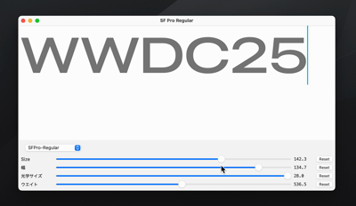

# Variable Font Mac

An implementation of a variable font feature that works on macOS using Core Text.

# License

[Project License](./LICENSE)

# Fonts

## Montserrat

https://github.com/cosmicmocha/Montserrat

## Recursive Sans

https://github.com/arrowtype/recursive